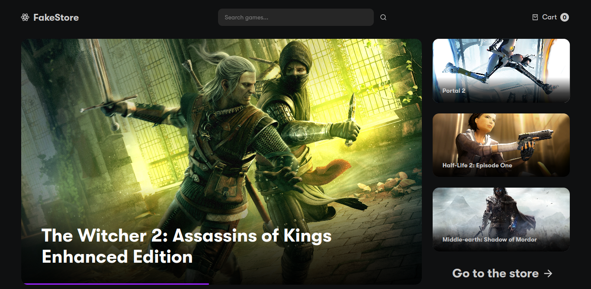
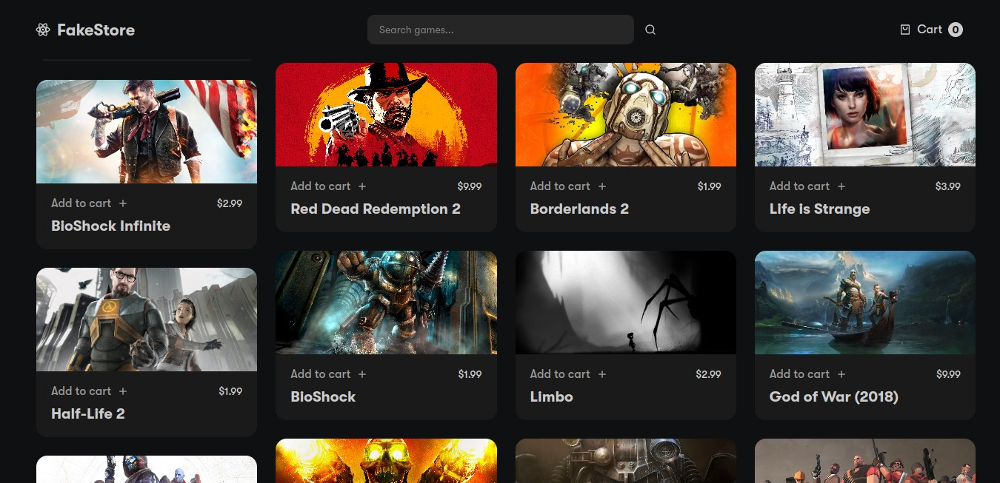
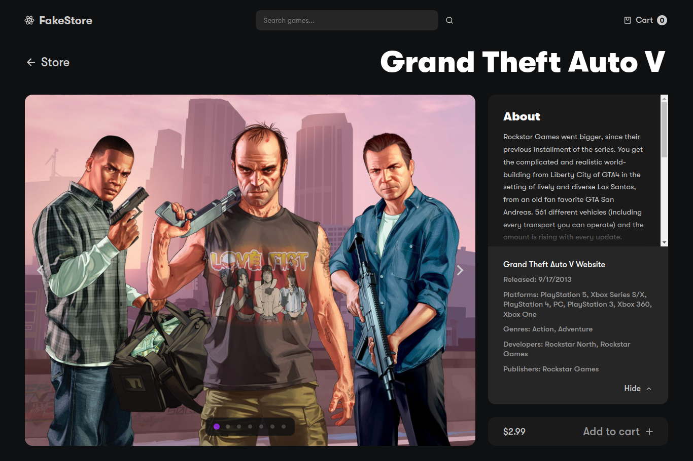
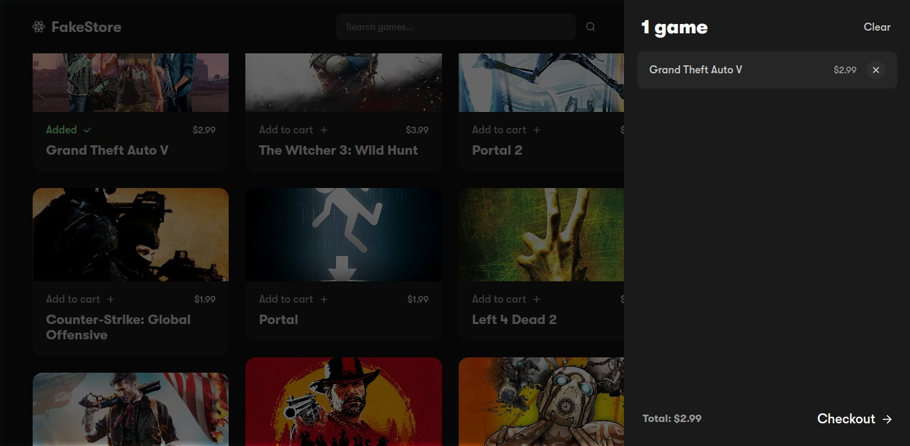

	<h1>Shopping Cart
	 
		
		
		 
	</h1>
	<h3><b><a href="https://rique2x.github.io/React-Shopping-Cart/">View Live Demo</a></b></h3>

## Description

A fake game store with a shopping cart created as part of [TheOdinProject](https://www.theodinproject.com) curriculum.

To see the assignment details - [Click Here](https://www.theodinproject.com/lessons/node-path-javascript-shopping-cart)

## Built Using

- React 
- TypeScript 
- Prettier 

## Credits

#### API

- [RAWG](https://rawg.io/apidocs)

#### Libraries

- [React Router](https://reactrouter.com)
- [Framer Motion](https://www.framer.com/motion/)
- [Daisy UI](https://daisyui.com/)

#### Icons

- [React Icons](https://github.com/react-icons/react-icons)
- [Google Material Icons](https://fonts.google.com/icons)
- [Ionicons](https://ionic.io/ionicons/)
- [Simple Icons](https://simpleicons.org/)

## Gallery

#### Desktop

#### Mobile Version Available